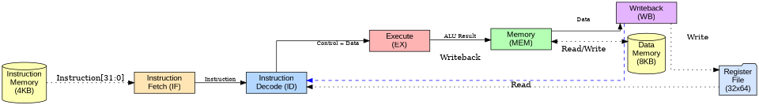
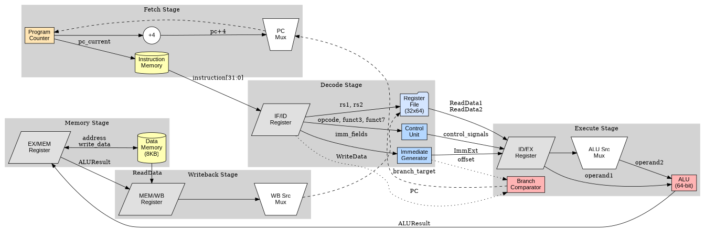
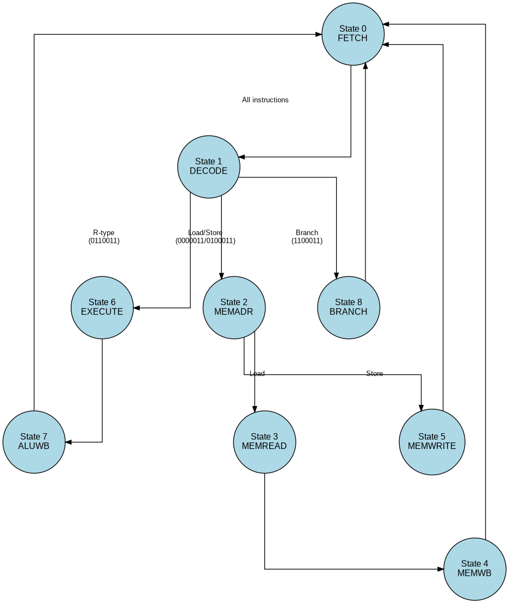
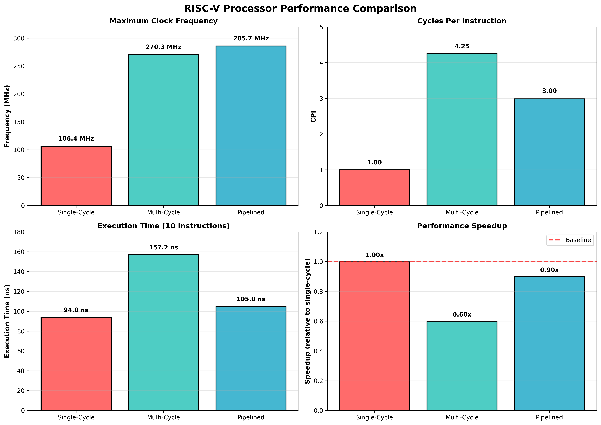
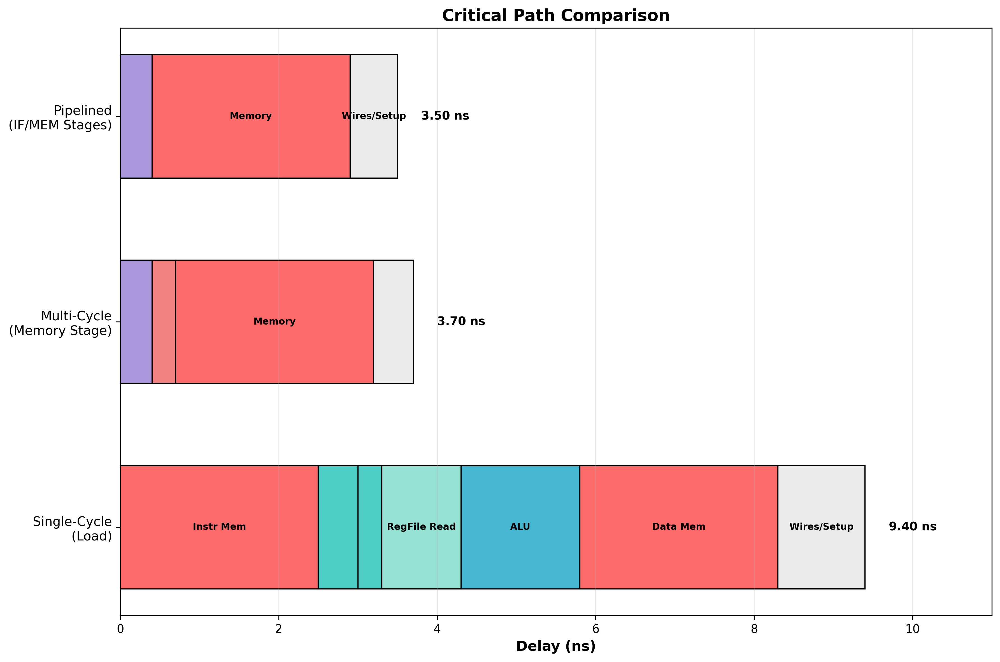

# RISC-V Processor Implementations

This repository contains three RTL implementations of RISC-V processors, demonstrating an architectural progression from single-cycle through multi-cycle to pipelined designs. Each implementation provides insights into different processor design trade-offs and optimizations.

## Overview

The repository includes:

1. **Single-Cycle Processor** - Complete RV32I base instruction execution in one cycle
2. **Multi-Cycle Processor** - Resource-efficient design with FSM-based control
3. **Pipelined Processor** - 5-stage pipeline with hazard detection and data forwarding

All implementations support the RV64I base integer instruction set including arithmetic, logic, load/store, and branch operations.

## Single-Cycle Processor

The baseline implementation executes instructions in a single clock cycle using a modular 5-stage datapath.



### Implementation Details

* **Instruction Fetch (IF):** Retrieves 32-bit instructions from instruction memory and updates the Program Counter. Supports sequential execution and branch target addressing.
* **Instruction Decode (ID):** Decodes opcodes, reads source operands from the Register File (32 x 64-bit), and generates control signals for subsequent stages.
* **Execute (EX):** Performs arithmetic and logic operations using the Arithmetic Logic Unit. Computes branch outcomes and target addresses.
* **Memory Access (MEM):** Interfaces with data memory for load and store instructions.
* **Writeback (WB):** Selects the final result (from ALU or memory) and writes data back to the destination register.



**Performance:**
- Clock Frequency: 106.38 MHz (9.40 ns period)
- CPI: 1.00
- Critical Path: Instruction fetch through memory access to register writeback

## Multi-Cycle Processor

Breaks instruction execution into multiple cycles using a finite state machine, allowing higher clock frequencies through critical path reduction.



### Architecture Changes

* **Memory Organization:** Unified 12KB Von Neumann architecture (shared instruction and data memory)
* **Resource Sharing:** Single ALU used across multiple cycles
* **FSM Controller:** 9-state machine controlling instruction flow
* **Internal Registers:** IR, MDR, A, B, ALUOut for intermediate value storage

**State Transitions:** FETCH → DECODE → MEMADR → MEMREAD/MEMWRITE → WRITEBACK

**Performance:**
- Clock Frequency: 270.27 MHz (3.70 ns period) - 2.54x improvement
- CPI: 4.25 (varies by instruction type)
- R-type: 4 cycles, Load: 5 cycles, Store: 4 cycles, Branch: 3 cycles

See `docs/diagrams/control_timing_diagram.png` for detailed control signal timing.

## Pipelined Processor

Five-stage pipeline enabling concurrent execution of multiple instructions with hazard detection and data forwarding.

### Pipeline Stages

1. **IF** - Instruction Fetch
2. **ID** - Instruction Decode and Register Read
3. **EX** - Execute and Address Calculation
4. **MEM** - Memory Access
5. **WB** - Register Writeback

### Hazard Handling


**Data Hazards:**
- Forwarding from EX/MEM and MEM/WB stages to EX stage
- Handles RAW (Read-After-Write) dependencies

**Load-Use Hazards:**
- Pipeline stalling when load result needed immediately
- Hazard detection unit inserts bubbles as needed

**Control Hazards:**
- Pipeline flushing on taken branches
- Branch decision in ID stage minimizes penalty

**Performance:**
- Clock Frequency: 285.71 MHz (3.50 ns period) - 2.69x improvement
- CPI: 3.00 (approaches 1.0 for large programs)
- Test Results: 4 forwarding events, 1 stall detected

## Performance Analysis

Timing analysis based on typical ASIC delays in modern process nodes.



### Clock Frequency Comparison

| Implementation | Maximum Frequency | Clock Period | Speedup |
|----------------|------------------|--------------|---------|
| Single-Cycle   | 106.38 MHz       | 9.40 ns      | 1.00x   |
| Multi-Cycle    | 270.27 MHz       | 3.70 ns      | 2.54x   |
| Pipelined      | 285.71 MHz       | 3.50 ns      | 2.69x   |

### Execution Performance

Test program: 10 instructions (arithmetic, load/store, branch mix)

| Implementation | CPI  | Execution Time | Relative Performance |
|----------------|------|----------------|---------------------|
| Single-Cycle   | 1.00 | 94.00 ns       | 1.00x (baseline)    |
| Multi-Cycle    | 4.25 | 157.25 ns      | 0.60x               |
| Pipelined      | 3.00 | 105.00 ns      | 0.90x               |



### Key Findings

The multi-cycle design achieves 2.54x higher clock frequency by breaking the critical path into smaller stages. However, increased CPI results in slower overall execution for small programs.

The pipelined design achieves the highest frequency (2.69x) while maintaining reasonable CPI. For larger programs, pipeline performance dominates as CPI approaches 1.0 after initial fill.

Performance formula: **Execution Time = Instructions × CPI × Clock Period**

## Directory Structure

```
├── docs
│   ├── diagrams
│   ├── Multi_Cycle.md
│   ├── Performance.md
│   └── Pipeline.md
├── pipelined_processor.vcd
├── pipelined_processor.vvp
├── README.md
├── rtl
│   ├── alu_control.v
│   ├── alu.v
│   ├── data_memory.v
│   ├── decode.v
│   ├── execute.v
│   ├── ex_mem_register.v
│   ├── fetch.v
│   ├── forwarding_unit.v
│   ├── fsm_controller.v
│   ├── hazard_detection_unit.v
│   ├── id_ex_register.v
│   ├── if_id_register.v
│   ├── instruction_memory.v
│   ├── internal_registers.v
│   ├── memory.v
│   ├── mem_wb_register.v
│   ├── multi_cycle_processor.v
│   ├── pipeline_control.v
│   ├── pipelined_processor.v
│   ├── register_file.v
│   ├── single_cycle_processor.v
│   ├── unified_memory.v
│   └── writeback.v
├── scripts
│   ├── generate_diagrams.py
│   ├── generate_flow.py
│   ├── generate_hazard_scenarios.py
│   ├── generate_performance_charts.py
│   ├── generate_pipeline_timing.py
│   └── timing_analysis.py
└── tb
    ├── decode_tb.v
    ├── execute_tb.v
    ├── fetch_tb.v
    ├── instruction_fetch_tb.vcd
    ├── memory_tb.v
    ├── multi_cycle_processor_tb.v
    ├── pipelined_processor_tb.v
    ├── single_cycle_processor_tb.v
    ├── test.vvp
    ├── uvm_tb_simple
    └── writeback_tb.v

```

## Verification

### Single-Cycle Verification

**Verilator Simulation:**
C++ testbench drives the Verilog model for cycle-accurate simulation with VCD waveform generation.

**Dependencies:** Verilator, Make, G++, GTKWave

```bash
cd tb
make -f Makefile.verilator build
./obj_dir/Vsingle_cycle_processor
```

**Directed Tests (Icarus Verilog):**
Structured testbench with Driver, Monitor, and Scoreboard components for directed testing.

**Dependencies:** Icarus Verilog, vvp

```bash
cd tb/uvm_tb_simple
make
```

### Multi-Cycle and Pipelined Verification

**Icarus Verilog Simulation:**

Multi-cycle processor:
```bash
iverilog -o multi_cycle.vvp rtl/fsm_controller.v rtl/internal_registers.v \
  rtl/unified_memory.v rtl/multi_cycle_processor.v tb/multi_cycle_processor_tb.v
vvp multi_cycle.vvp
gtkwave multi_cycle.vcd
```

Pipelined processor:
```bash
iverilog -o pipelined.vvp rtl/register_file.v rtl/alu.v rtl/alu_control.v \
  rtl/instruction_memory.v rtl/data_memory.v rtl/if_id_register.v \
  rtl/id_ex_register.v rtl/ex_mem_register.v rtl/mem_wb_register.v \
  rtl/hazard_detection_unit.v rtl/forwarding_unit.v rtl/pipeline_control.v \
  rtl/pipelined_processor.v tb/pipelined_processor_tb.v
vvp pipelined.vvp
gtkwave pipelined.vcd
```

All implementations pass functional verification with identical test programs verifying correct arithmetic, memory operations, and control flow.

## Documentation

Detailed documentation available in `docs/`:

- **Multi_cycle.md** - Multi-cycle architecture, FSM states, control signals, performance
- **Pipeline.md** - Pipeline stages, hazard handling, forwarding logic, verification
- **Performance.md** - Timing methodology, critical path analysis, scalability

## Generating Diagrams

Architecture diagrams (Phase 2 pipeline):
```bash
cd scripts
python3 generate_pipeline_datapath.py
python3 generate_hazard_scenarios.py
python3 generate_pipeline_timing.py
```

Performance analysis:
```bash
cd scripts
python3 timing_analysis.py
python3 generate_performance_charts.py
```

All diagrams saved to `docs/diagrams/`

## Design Progression

This repository demonstrates the evolution of processor architectures:

1. **Single-Cycle** - Simple design, high power, limited by slowest instruction
2. **Multi-Cycle** - Resource sharing, higher frequency, variable CPI
3. **Pipelined** - Instruction-level parallelism, best performance for sustained workloads

Each implementation provides trade-offs in complexity, performance, power, and area suitable for different application requirements.

## Future Enhancements

- Branch prediction (static and dynamic)
- Deeper pipelines with more stages
- Superscalar execution (multiple issue)
- Out-of-order execution
- Cache hierarchy
- Memory management unit
- Privilege levels and exception handling

## References

- RISC-V ISA Specification: https://riscv.org/specifications/
- Computer Organization and Design (Patterson & Hennessy)
- Digital Design and Computer Architecture (Harris & Harris)

## License

This project is for educational purposes.